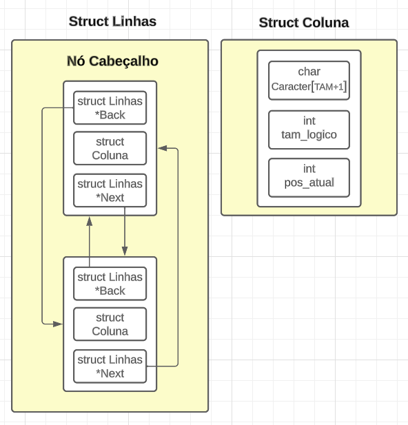

# Estrutura de Dados para Editor de Texto Simples em C

O desenvolvimento de um editor de texto simples em C demanda uma cuidadosa escolha da estrutura de dados para armazenar e manipular eficientemente cada caractere do texto. Diversas opções foram consideradas, como listas duplamente encadeadas e listas dinâmicas circulares duplamente encadeadas, cada uma com suas vantagens e desvantagens. A escolha final recaiu sobre uma lista dinâmica circular com nó cabeçalho duplamente encadeada, que apresenta eficiência nas operações essenciais.

## Escolha da Estrutura

A estrutura escolhida consiste em nós que representam cada linha do texto. Dentro de cada nó, há uma lista estática que representa as colunas da linha. O nó cabeçalho facilita operações de inserção e remoção, fornecendo referências para o início e o fim da lista. Essa abordagem elimina a necessidade de ponteiros para ponteiros em muitas funções, tornando o código mais legível e eficiente.

## Vantagens da Estrutura

- **Natureza Circular:** A lista circular permite fácil navegação entre as linhas, permitindo chegar à última linha percorrendo a lista apenas uma vez, em vez de percorrer todos os elementos.
  
- **Duplo Encadeamento:** O duplo encadeamento simplifica a manipulação dos elementos, tornando mais eficiente a inserção, remoção e manipulação de linhas, especialmente em operações frequentes como inserção e remoção.

## Flexibilidade e Eficiência

A escolha da lista dinâmica circular duplamente encadeada com nó cabeçalho é motivada pela eficiência nas operações essenciais de percorrer, inserir, remover e manipular cada nó. Sua natureza dinâmica permite que o tamanho do texto seja flexível, ajustando-se conforme necessário. 

A representação matricial do texto, simulada com linhas (nós) e colunas (listas estáticas), garante acesso eficiente aos caracteres individuais. A estrutura oferece um equilíbrio entre eficiência e flexibilidade, atendendo aos requisitos de um editor de texto simples desenvolvido em C.
